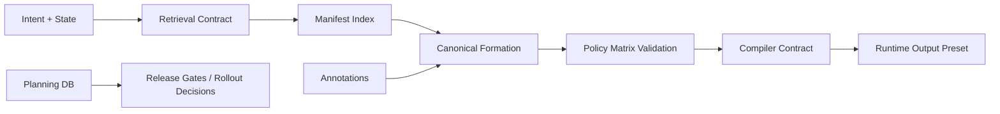

# Repository Architecture — The Book of Formation (AETHERIUM · GENESIS)

## 1. System Role

The repository is a **knowledge and governance layer** for formation behavior.
It does not execute runtime rendering or transport logic.

### Responsibility split
- **This repository:** canonical semantics, policy, contracts, and planning controls.
- **Runtime systems (external):** retrieval service, compiler implementation, rendering engine, message bus.

---

## 2. Component Map

1. **Canonical formation data**
   - `manifest/formations.index.yaml`
   - `manifest/lineage.index.yaml`
   - `formations/*.yaml`

2. **Semantic interpretation layer**
   - `annotations/human/*`
   - `annotations/machine/*`

3. **Governance and safety policy**
   - `policy/formation-policy-matrix.yaml`
   - `policy/review-checklist.yaml`
   - `policy/allowed-enums.yaml`

4. **Integration contracts**
   - `specs/retrieval-contract.md`
   - `specs/compiler-contract.md`
   - `specs/aetherbus-adapter-spec.md`
   - `specs/evaluation-harness-spec.md`

5. **Operational planning control plane**
   - `platform/create_platform_work.md`
   - `platform/db/platform_work_schema.sql`
   - `platform/db/seed_aetherium_genesis.sql`

---

## 3. Data Flow (Logical)

---

## 4. Consistency and Migration Notes

- `formations/` is the canonical source for active formation records.
- `formation/` is retained as legacy/migration reference and should not be used as primary runtime input.
- Planning data is persisted in SQL (`platform/db`) to reduce spreadsheet/document drift and duplication.

---

## 5. Production Readiness Controls

- Schema constraints for backlog, gates, risks, rollout phases.
- Seed data includes workstreams, epics/stories/tasks, gates, risks, and rollout phases.
- Update timestamp triggers are deterministic and re-runnable.
